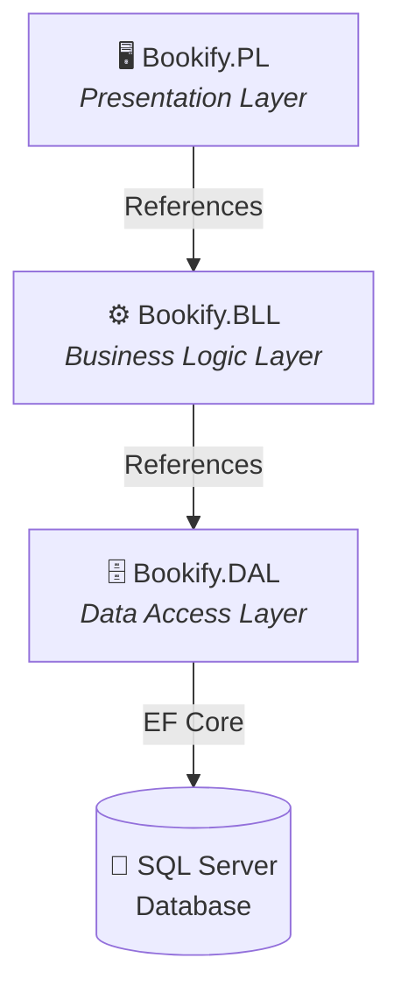

<p align="center">
  
  
  
  
  
</p>

# 📚 Bookify — Library Management System

**Bookify** is a full-featured library management web application built with **ASP.NET Core MVC (.NET 9)**. It provides a clean, role-based administrative interface for managing books, authors, categories, book copies, and users with a modern, responsive UI.

---

## ✨ Features

| Module | Capabilities |
|--------|-------------|
| **Books** | CRUD operations, image upload with thumbnail generation, server-side DataTables (search, sort, paginate), category & author assignment, soft-delete toggle |
| **Authors** | Create, edit, toggle status (soft delete), remote validation for uniqueness |
| **Categories** | Full CRUD with soft-delete support, remote validation |
| **Book Copies** | Manage multiple copies per book (edition number, rental availability), serial tracking |
| **Users** | Role-based user management (Admin-only), create/edit users, assign roles, reset passwords, lock/unlock accounts, toggle status |
| **Authentication** | ASP.NET Core Identity with role-based authorization (Admin, Archive, Reception), email confirmation, custom claims |
| **Image Handling** | Local disk storage with automatic thumbnail generation using ImageSharp, Cloudinary integration ready |
| **UI/UX** | Responsive Bootstrap 5 layout, AJAX modals, Bootbox confirm dialogs, Animate.css transitions, jQuery DataTables |

---

## 🏗️ Architecture

The solution follows a **3-Layer Architecture** with clear separation of concerns:

```
Bookify.slnx
├── Bookify.PL          → Presentation Layer  (ASP.NET Core MVC)
├── Bookify.BLL         → Business Logic Layer (Services, DTOs, Mappers)
└── Bookify.DAL         → Data Access Layer    (Entities, Repositories, DbContext)
```



### Layer Responsibilities

#### 📦 Bookify.DAL — Data Access Layer
- **Entities** — Domain models (`Book`, `Author`, `Category`, `BookCopy`, `BookCategory`, `ApplicationUser`) with rich behavior and encapsulated state
- **Base Entity** — Shared audit fields (`CreatedBy`, `CreatedOn`, `LastUpdatedBy`, `LastUpdatedOn`, `IsDeleted`)
- **Repositories** — Generic repository pattern (`IRepository<T>`) with specialized repositories per entity
- **Configurations** — EF Core Fluent API configurations for each entity
- **Database** — `BookifyDbContext` with migrations
- **Seed** — Default roles (Admin, Archive, Reception) and admin user seeding at startup

#### ⚙️ Bookify.BLL — Business Logic Layer
- **Services** — Interface / Implementation pairs (`IBookService`, `IAuthorService`, `ICategoryService`, `IBookCopyService`, `IUserService`)
- **DTOs** — Domain-specific data transfer objects for create, update, and view operations
- **Mapper** — AutoMapper profiles for entity ↔ DTO mapping
- **Response Result** — Standardized `Response<T>` wrapper with status codes and error messaging
- **Validation** — Business rule validation layer

#### 🖥️ Bookify.PL — Presentation Layer
- **Controllers** — `BooksController`, `AuthorsController`, `CategoriesController`, `BookCopiesController`, `UsersController`, `HomeController`, `CountryController`
- **Views** — Razor views with shared layout, partials (`_Modal`, `_UserRow`, `_BookCopyRow`, `_DataTablesCardHeader`), and area-based Identity UI
- **ViewModels** — Form and display view models per feature
- **Filters** — Custom action filters (`AjaxOnlyAttribute`)
- **Helpers** — Tag helpers (`ActiveTag`), custom `ApplicationUserClaimsPrincipalFactory`
- **Settings** — Strongly-typed configuration (`CloudinarySettings`)

---

## 🛠️ Tech Stack

| Layer | Technology |
|-------|-----------|
| **Framework** | .NET 9 / ASP.NET Core MVC |
| **ORM** | Entity Framework Core 9 |
| **Database** | SQL Server (LocalDB) |
| **Identity** | ASP.NET Core Identity |
| **Mapping** | AutoMapper 16 |
| **Image Processing** | SixLabors.ImageSharp |
| **Cloud Storage** | Cloudinary (optional) |
| **Front-End** | Bootstrap 5.2, jQuery, jQuery DataTables |
| **Client Libraries** | Bootbox.js, Animate.css, jQuery Unobtrusive Ajax, Expressive Annotations |
| **Validation** | ExpressiveAnnotations.NetCore (conditional client-side validation) |
| **Dynamic LINQ** | Microsoft.EntityFrameworkCore.DynamicLinq (server-side sorting) |

---

## 📁 Project Structure

```
Bookify/
├── Bookify.DAL/
│   ├── Common/              # Global usings, DI registration, consts, pipeline helpers
│   ├── Configurations/      # EF Core entity configurations
│   ├── Database/            # DbContext & Migrations
│   ├── Entities/            # Domain models & BaseEntity
│   ├── Repositories/        # IRepository<T> & concrete repos
│   └── Seed/                # DefaultRoles & DefaultUsers
│
├── Bookify.BLL/
│   ├── Common/              # Global usings, DI registration, response result, validation
│   ├── DTOs/                # Data transfer objects (Author, Book, BookCopy, Category, User, Role)
│   ├── Mapper/              # AutoMapper profiles
│   └── Service/             # Service interfaces & implementations
│
├── Bookify.PL/
│   ├── Areas/Identity/      # Scaffolded Identity UI pages
│   ├── Common/              # Global usings
│   ├── Consts/              # Application constants
│   ├── Controllers/         # MVC controllers
│   ├── Filters/             # Custom action filters
│   ├── Helpers/             # Tag helpers & claims factory
│   ├── Mapper/              # PL-specific AutoMapper profile (DomainProfile)
│   ├── Settings/            # Strongly-typed settings (Cloudinary)
│   ├── ViewModels/          # View models per feature
│   ├── Views/               # Razor views & shared layout
│   ├── wwwroot/             # Static assets (CSS, JS, images, client libs)
│   ├── Program.cs           # Application entry point & DI configuration
│   └── appsettings.json     # Connection strings & app configuration
│
└── SQL Scripts/             # Seed data SQL scripts (Authors, Categories, Books, BookCategories)
```

---

## 🚀 Getting Started

### Prerequisites

- [.NET 9 SDK](https://dotnet.microsoft.com/download/dotnet/9.0)
- [SQL Server LocalDB](https://learn.microsoft.com/en-us/sql/database-engine/configure-windows/sql-server-express-localdb) (included with Visual Studio)
- [Visual Studio 2022+](https://visualstudio.microsoft.com/) or [VS Code](https://code.visualstudio.com/) with C# Dev Kit

### Setup

1. **Clone the repository**
   ```bash
   git clone https://github.com/YoussefS3eed/Bookify.git
   cd Bookify
   ```

2. **Restore dependencies**
   ```bash
   dotnet restore
   ```

3. **Update the connection string** (if needed)

   Edit `Bookify.PL/appsettings.json`:
   ```json
   {
     "ConnectionStrings": {
       "DefaultConnection": "Server=(localdb)\\MSSQLLocalDB;Database=Bookify;Trusted_Connection=True;MultipleActiveResultSets=true"
     }
   }
   ```

4. **Apply database migrations**
   ```bash
   dotnet ef database update --project Bookify.DAL --startup-project Bookify.PL
   ```

5. **Run seed SQL scripts** (optional — for sample data)

   Execute the scripts in `SQL Scripts/` folder in order:
   1. `01. dbo.Authors.data.sql`
   2. `02. dbo.Categories.data.sql`
   3. `03. dbo.Books.data.sql`
   4. `04. dbo.BookCategories.data.sql`

6. **Configure Cloudinary** (optional)

   Add your Cloudinary credentials to `appsettings.json`:
   ```json
   {
     "CloudinarySettings": {
       "Cloud": "your-cloud-name",
       "ApiKey": "your-api-key",
       "ApiSecret": "your-api-secret"
     }
   }
   ```

7. **Run the application**
   ```bash
   dotnet run --project Bookify.PL
   ```
   The app will be available at `https://localhost:5001` (or the port shown in the console).

### Default Admin Account

On first startup, the application seeds a default admin user:

| Field | Value |
|-------|-------|
| **Username** | `admin` |
| **Email** | `admin@bookify.com` |
| **Password** | `P@ssword123` |

> ⚠️ **Change the default admin password immediately after first login.**

---

## 🔐 Role-Based Access

| Role | Permissions |
|------|------------|
| **Admin** | Full system access — manage books, authors, categories, copies, and users |
| **Archive** | Book & catalog management operations |
| **Reception** | Front-desk operations |

---

## 🧩 Key Design Patterns

- **Repository Pattern** — Generic `IRepository<T>` with entity-specific extensions
- **Service Layer Pattern** — Business logic encapsulated in service classes behind interfaces
- **DTO Pattern** — Separate create/update/view DTOs to decouple layers
- **Rich Domain Model** — Entities contain behavior (e.g., `Book.Update()`, `Book.ToggleStatus()`, `Author.Update()`)
- **Result Pattern** — Standardized `Response<T>` wrapper for service responses with status codes
- **Dependency Injection** — Modular DI registration per layer (`AddDataAccessLayerInPL()`, `AddBusinessLogicLayerInPL()`)
- **Soft Delete** — `IsDeleted` flag with toggle operations instead of hard deletes

---

## 📄 License

This project is licensed under the [MIT License](LICENSE).

---

## 👤 Author

**Youssef Saeed** — [@YoussefS3eed](https://github.com/YoussefS3eed)
